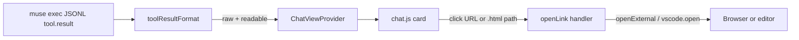

# Readable tool output (phased)

## Goal

Stop dumping opaque JSON blobs for tool results. Show a developer-friendly terminal-style card by default, keep one-click access to raw JSON, and make URLs / local HTML paths clickable. Defer a Claude Desktop–style side canvas until the inline surface feels right.

## Current behavior

- Live `tool.result` events become pretty JSON in [`src/museJsonl.ts`](src/museJsonl.ts) (`stringifyPayload`).
- [`media/chat.js`](media/chat.js) renders them as plain `textContent` (no links), truncated to 2k.
- No display setting exists; [`package.json`](package.json) `muse.*` settings are CLI-only.

## Phase 1 (ship now): inline readable cards + link open

### 1. Parse known exec envelopes; format for humans

In [`src/museJsonl.ts`](src/museJsonl.ts) (or a small new `src/toolResultFormat.ts`):

- Detect structured results shaped like your sample (`command` / `description` / `exit_code` / `output` / `truncated`).
- Emit a richer UI event, e.g. `{ kind: "tool", name, resultRaw, resultView }` where:
  - `resultRaw` = pretty JSON (full envelope)
  - `resultView` = readable text, e.g.

```text
$ ls -lah ...   # or description
exit 0

<output>
```

- Unknown / non-object results stay as today (string or JSON), still linkifiable in the UI.
- Default presentation mode for known shapes: **readable**; unknown payloads: still JSON (auto).

Keep transcript cache in [`src/transcript.ts`](src/transcript.ts) storing enough to rehydrate both views (store `resultRaw` + optional structured fields, or store raw and re-format on paint). Prefer storing the raw string/object and formatting at render time so history and live stay consistent.

### 2. Setting + per-card toggle

Add to [`package.json`](package.json) configuration:

- `muse.toolOutputFormat`: enum `"readable" | "json"`, default `"readable"`.
  - Controls the **default** view for new tool cards (and history paint).
  - Document in [`README.md`](README.md) Settings table.

In the webview ([`media/chat.js`](media/chat.js) + [`media/chat.css`](media/chat.css)):

- Compact tool card: label (`tool: shell` / description), exit badge when present, monospace body.
- Small **Raw** / **Readable** control on each card (overrides the setting for that card only).
- Collapsed preview (first ~N lines) with expand for long stdout; keep a hard cap for the sidebar, but higher than today’s blunt 2k cut when expanded / when opening full content later.

Pass the setting into the webview on `ready` (and on `onDidChangeConfiguration` for `muse.toolOutputFormat`).

### 3. Clickable URLs and file pointers

Today everything is `textContent`, so links never work. For tool (and optionally stderr/unknown) bodies:

- Linkify safely: detect `https?://…`, `file://…`, and absolute paths ending in common web/docs extensions (at least `.html`, `.htm`; also allow bare `http(s)`).
- Render as `<a href="…">` with `preventDefault`; `postMessage({ type: "openLink", href })`.
- Escape all non-link text (XSS-safe; never inject raw HTML from Muse output).

In [`src/chatViewProvider.ts`](src/chatViewProvider.ts) handle `openLink`:

| Target | Action |
|--------|--------|
| `http:` / `https:` | `vscode.env.openExternal` |
| `file:` URI or absolute path to an existing file | Prefer `vscode.env.openExternal(vscode.Uri.file(...))` so **HTML opens in the system browser**; if that fails or user has no handler, fall back to `vscode.open` in the editor |
| Relative paths | Resolve against the active Muse workspace folder from [`WorkspaceFolderStore`](src/workspaceFolder.ts) when possible |

Do **not** open arbitrary schemes. Reject `javascript:`, etc.

### 4. Tests + docs

- Unit tests for exec-envelope formatting and link detection/path resolution (new or extend [`src/museJsonl.test.ts`](src/museJsonl.test.ts)).
- Fixture snippet covering a `tool.result` with your exec shape (optional under `fixtures/`).
- Changelog entry under a new patch version; README setting row.

## Phase 2 (later, not in this change): true canvas panel

Document as follow-up only:

- Compact chip stays in chat; **Open in canvas** opens a `WebviewPanel` beside the editor with full output, same Readable/Raw toggle, same link handling.
- Reuse the Phase 1 formatter and `openLink` path so the panel is mostly a larger host for the same card.

No Phase 2 code in this pass.

## Architecture (Phase 1)



## Out of scope for Phase 1

- Separate canvas `WebviewPanel`
- Markdown/HTML preview of tool output inside the sidebar
- Changing Muse CLI payload shapes
- Streaming partial tool stdout (still one-shot `tool.result`)
